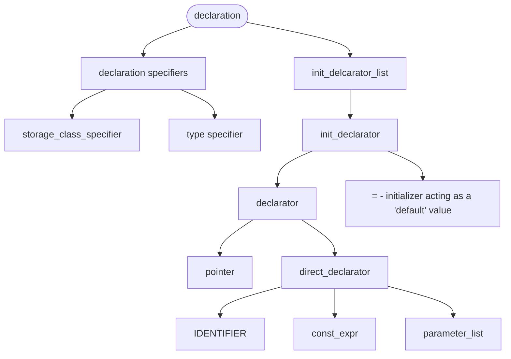

# Parser Implementation, Statergy, and Updates

## Introduction

The general idea with the parser is to ensure that there is complete declaration of all grammar relevant to compile code in C. We used Yacc to write this parser and used the [full example](https://www.lysator.liu.se/c/ANSI-C-grammar-y.html) parser as a basline for our final design. This baseline was expanded on by focusing on certain sections within the parser that were related and testing this in tandem with the files in the `include` folder and the work in the codegen section.

---

## Grammar changes with respect to the corresponding ast file

### Constants

The only additions to this section was the addition of the `FloatConstnt` and `StrConstant` functions.

These functions fell under the "primary expression" node, mirroring the behaviour of the `IntConstant` function already given, with slight changes being to the type of the variable parsed.

---

### Declaration

This section involved the following grammar:

- Function declaration
- Initialization declaration
- Struct declaration
- Pointer declaration
- Array declaration
- Enum declaration
- Type declartion
- Parameter declaration

This block of grammar allowed us to declare what type of variable was being parsed to codegen. This is integral as it allows for our specific functions in codegen to handle the requirements of each variable and also ensures that when checking for errors in the future, we would be able to detect specifically what varibles were having issues.

These sections would follow the grammar structure shown below:



---

### Expressions

This section involved the following grammar:

- Unary expressions
- Binary operations and expressions
- Arithmetic expresions
- Boolean expressions

The grammar structure followed a "Precedence Ladder" format, where the lowest precedence operations are placed at the top of the grammar.

Our grammar structure followed the following order:

1.  expression

2. assignment_expression

3. conditional_expression 

4. logical_or_expression

5. logical_and_expression

6. incusive_or_expression 

7. exclusive_or_expression 

8. and_expression 

9. equality_expression

10. relation_expression

11. shift_expression

12. additive_expression 

13. multiplicative_expression 

14. cast_expression

15. unary_expression

16. postfix_expression 


---

These would lead to code detailing every possible grammr rule for a certain expression such as this:

```

multiplicative_expression
	: cast_expression { $$ = $1; }
	| multiplicative_expression '*' cast_expression { $$ = new MulExpression(NodePtr($1), NodePtr($3)); }
	| multiplicative_expression '/' cast_expression { $$ = new DivExpression(NodePtr($1), NodePtr($3)); }
	| multiplicative_expression '%' cast_expression { $$ = new ModExpression(NodePtr($1), NodePtr($3)); }
	;

```


In cases where a function is required, we pass on the sub expressions as Nodes (through `NodePtr` as defined in `src/ast_node.hpp`). This was done as it allows for polymorphism (which is used throughout this project), and cleaner memory management (given the prevention of memory leaks when deleting a parent node for example).

When passed to a the `ast_expressions.hpp` file, the function would be executed as such:

```

class MulExpression : public BinaryOp {
 public:
  MulExpression(NodePtr a, NodePtr b) : BinaryOp(lhs: std::move(a), rhs: std::move(b)) {}

 private:
  const char* op_name() const override { return "*"; }
  void emit_op(std::ostream& out) const override { out << "mul a0, t0, a0\n"; }
};

```

---

### Jump Statements

The `jump_statement` node was expanded to allow for the following grammar depending on certain tokens:

| Token/s | New Function |
| - | - |
| RETURN | ReturnStatement(nullptr) **Note this function was the only one previously implemented** |
| GOTO IDENTIFIER | GotoStatement |
| CONTINUE | ContinueStatement |
| BREAK | BreakStatement |
| RETURN expresion | ReturnStatement(expression) |

These functions had a very simiar template to the one given in the full example: 

```

class ReturnStatement : public Node {
 private:
  NodePtr expression_;

 public:
  ReturnStatement(NodePtr expression) : expression_(std::move(expression)) {}

  void EmitRISC(std::ostream& stream, Context& context) const override;
  void Print(std::ostream& stream) const override;
};

```
